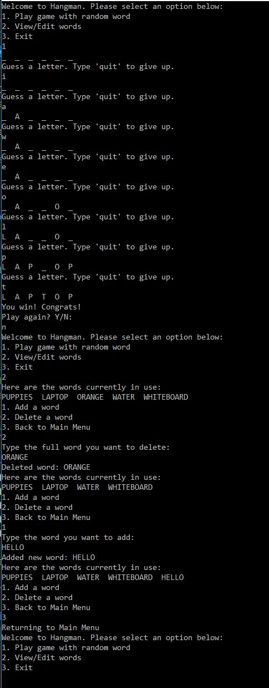

# Lab03-systemIO
This is a console app created with C# to showcase ability to work with System IO by creating, reading, updating and deleting (CRUD), the file, with input from the user. It features a hangman style minigame. 

## Visual

## How to use
1. Clone repo
2. Open .sln file using Visual Studio
3. Run console app
4. Follow directions on console
5. Enjoy!

## Author
Richard Jimenez at Code Fellows 401d5